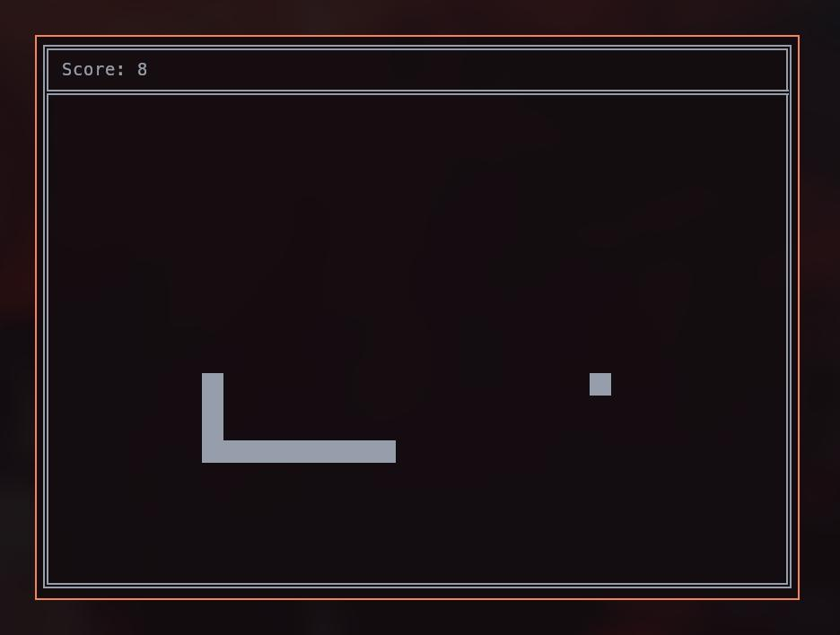

# TerminalSnake

A terminal version of the game Snake.

### Compile

To play just compile it with `make`, then run it with `bin/snake`.

### Controls

You can move with the `Arrow Keys`, `AWSD` or `HJKL` for the vim enjoyers.
